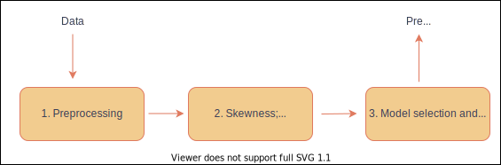
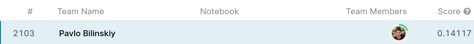

# Housing Prices Prediction

Predictive model for competition [House Prices - Advanced Regression Techniques](https://www.kaggle.com/c/house-prices-advanced-regression-techniques) on Kaggle.

The project consists of two parts:

1. **Analysis in Jupyter Notebooks**. The whole process of making decisions, set up for reading.
2. **Code**. Structured and clean code, performs all computations and generates predictions. To execute it on your local machine, clone the repository and sequentially run two scripts:

   ```
    python main.py
    python train_main.py
    ```
   

## Pipeline of the model

Consider the following scheme:
<p align="center">
   
</p>

1. [Preprocessing.](data_preparation.ipynb)
   - cleaning
   - missing values handling
   - feature encoding
   - feature generation
   - feature selection

2. [Skewness; outliers detection.](skewness_and_outliers.ipynb)
   - basic Exploratory Data Analysis
   - transformations of features
   - outliers detection and removing

3. [Model selection and validation.](training_and_model_selection.ipynb )
   - cross-validation
   - hyperparameters tuning
   - training ML models: Ridge, LASSO, ElasticNet, Support Vector Regressor, XGBoost Regressor
   - computing feature's importances
   - prediction

## Achievments
Position on the leaderboard: top 47%.



